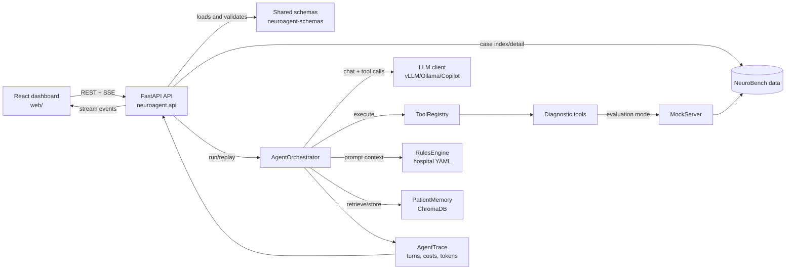
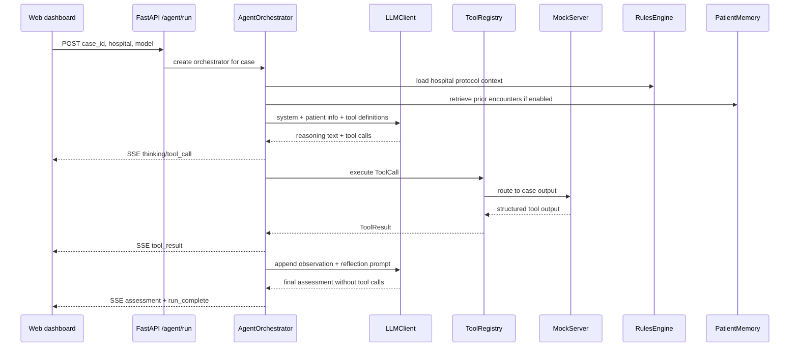
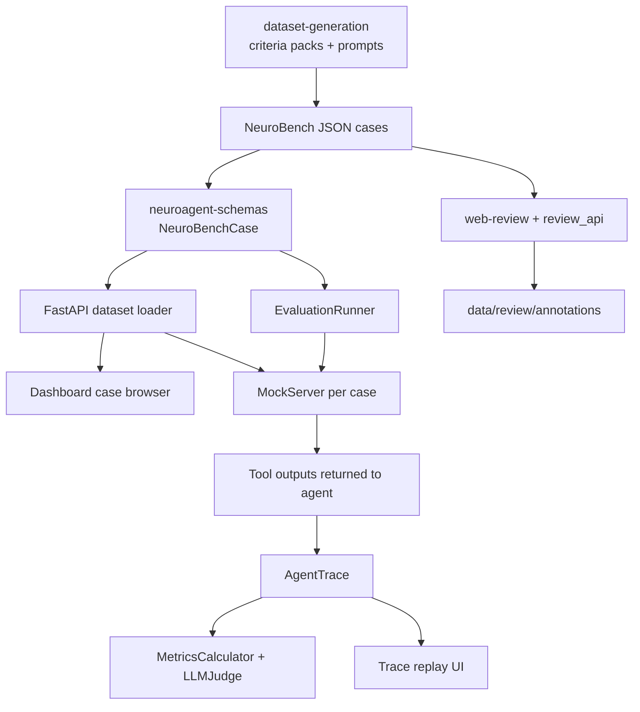
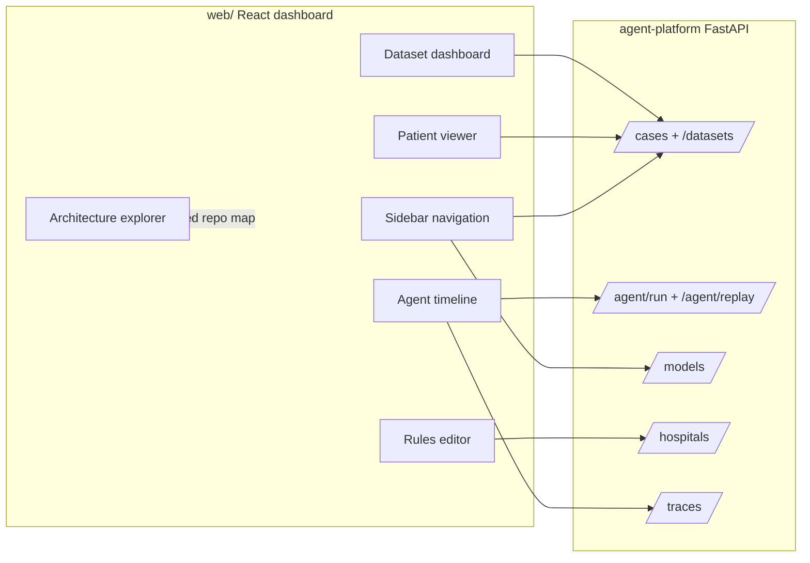
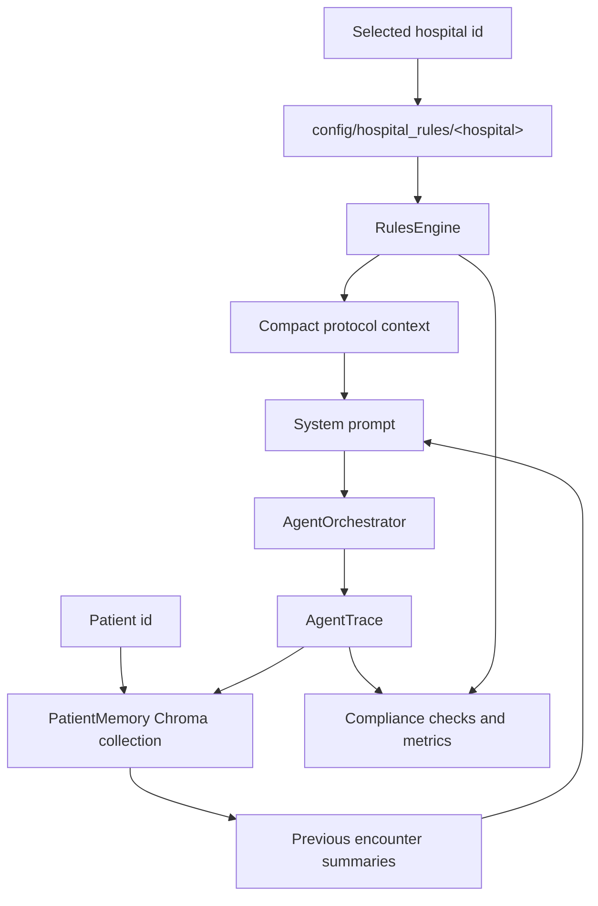
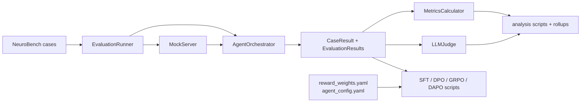
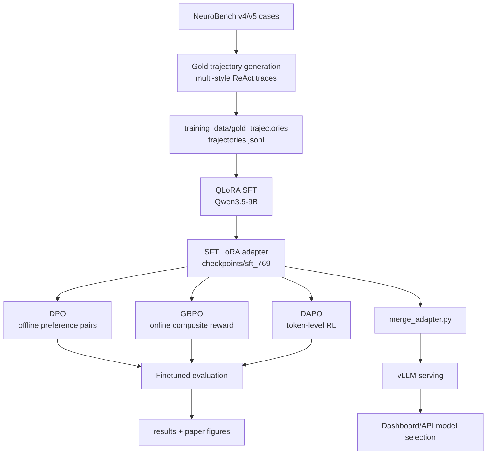
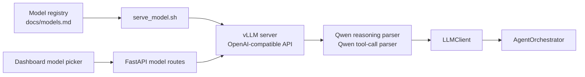
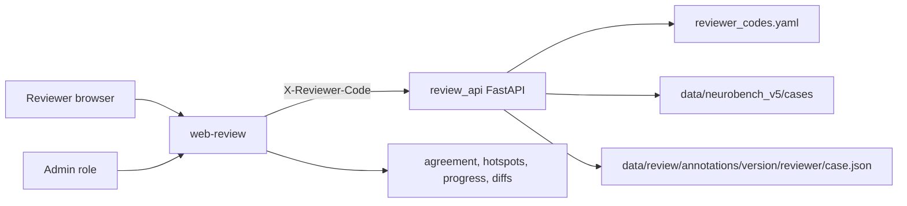
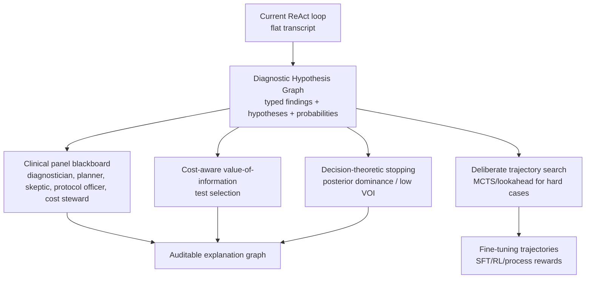

# NeuroAgent Architecture and Repository Breakdown

## Executive Summary

NeuroAgent is a tool-augmented clinical reasoning platform for neurological decision support. The repository combines a Python agent runtime, shared Pydantic schemas, versioned NeuroBench datasets, dataset-generation workflows, two React frontends, clinical review tooling, evaluation scripts, and publication/research material.

The core runtime is `agent-platform`: FastAPI loads NeuroBench cases, the `AgentOrchestrator` runs a ReAct loop, the LLM chooses diagnostic tools, the `ToolRegistry` dispatches those tools, `MockServer` returns case-grounded outputs in evaluation mode, hospital rules are injected as prompt context, and each run is saved as an `AgentTrace`.

## Repository Map

| Path | Purpose | Role |
|---|---|---|
| `agent-platform/` | Main Python package: orchestrator, tools, API, review API, rules, memory, evaluation, training, scripts, tests. | Core runtime |
| `agent-platform/src/neuroagent/training/` | Training code for QLoRA SFT, DPO, GRPO, DAPO, adapter merge, and finetuned evaluation. | Fine-tuning |
| `agent-platform/docs/finetuning-plan.md` | Current fine-tuning status, LoRA/QLoRA settings, results, bottlenecks, and roadmap. | Fine-tuning docs |
| `agent-platform/docs/models.md` | Model inventory, vLLM serving flags, Qwen thinking/tool parsing, AWQ Marlin guidance. | Model serving |
| `packages/neuroagent-schemas/` | Shared Pydantic models for cases, patient profiles, ground truth, evaluation records, and tool outputs. | Contracts |
| `dataset-generation/` | NeuroBench case-generation pipeline, criteria packs, validation, prompt templates, and authoring guides. | Data factory |
| `data/` | Versioned NeuroBench datasets, case evaluations, review artifacts, traces, audit reports. | Corpus |
| `web/` | Main Vite/React dashboard for cases, model loading, agent streaming, trace replay, rules, and architecture exploration. | Frontend |
| `web-review/` | Separate doctor-led review UI for blinded annotations and admin aggregation. | Review frontend |
| `research/reasoning-frameworks/` | Survey and roadmap for replacing linear ReAct with graph/search/panel reasoning. | Research |
| `deployment/` | Hostinger and Raspberry Pi deployment notes, service files, Nginx config, backup scripts. | Operations |
| `papers/`, `presentations/`, `nmi-paper-plan/` | Explainers, publication assets, presentation source, and paper planning. | Publication |

## Runtime Architecture

## Agent Reasoning Loop

Current reasoning is a linear ReAct transcript:

1. **THINK**: assistant visible reasoning text.
2. **ACT**: OpenAI-style function/tool call.
3. **OBSERVE**: serialized `ToolResult`.
4. **REFLECT**: templated prompt asking the model to update reasoning.
5. **ASSESS**: final markdown section extracted from `### Primary Diagnosis`.

Important limitation: there is no structured differential diagnosis object. The working state is the conversation transcript plus final markdown.

## Data Flow

The current default dataset is NeuroBench v5: 516 cases across 20 neurological conditions. Case files include patient presentation, initial tool outputs, conditional follow-up outputs, fallback outputs for off-pathway tool calls, and ground truth.

## API and UI Flow

The dashboard uses `Zustand` for local UI state and `TanStack Query` for API-backed state. Agent runs and trace replays stream as Server-Sent Events so the timeline can render reasoning, tool calls, observations, reflections, and assessment as they arrive.

## Rules and Memory

Hospital rules are not exposed as a callable tool. They are injected into the system prompt and later used for compliance checks. All pathways for the selected hospital are injected so selecting a pathway does not leak the diagnosis.

## Evaluation and Training

The evaluation stack reuses the same agent runtime, tool registry, schemas, and patient formatting used by the web API. This keeps dashboard demos and benchmark runs aligned.

## Fine-Tuning and Model Serving

### Training Techniques

| Technique | How this repo uses it | Key files |
|---|---|---|
| LoRA | Adds trainable low-rank adapters to attention and MLP projections. Current default: rank 64, alpha 128, dropout 0.05. | `training/train_grpo.py`, `training/train_dpo.py` |
| QLoRA | Loads the base model in 4-bit NF4 with bfloat16 compute and double quantization so Qwen3.5-9B can train on a single A100-40GB. | `get_quantization_config()` in `train_grpo.py` |
| SFT | Supervised fine-tuning on gold ReAct trajectories using prompt/completion formatting and completion-only loss masking. | `scripts/run_sft_training.sh`, `train_grpo.py --stage sft` |
| DPO | Offline preference optimization from pre-collected scored rollouts; avoids online generation during training. | `training/train_dpo.py`, `scripts/run_dpo_training.sh` |
| GRPO | Online reward optimization over grouped completions with rewards for correctness, tool precision/recall, cost, format, and safety. | `training/train_grpo.py`, `scripts/run_grpo_training.sh` |
| DAPO | Token-level policy-gradient RL with asymmetric clipping, intended to behave better on long ReAct traces. | `training/train_dapo.py`, `scripts/run_dapo_training.sh` |
| vLLM | Serves base, quantized, and tuned models through an OpenAI-compatible endpoint for the dashboard, scripts, and evaluation. | `scripts/serve_model.sh`, `scripts/serve_dual.sh`, `docs/models.md` |

### Current Fine-Tuning State

- Data pipeline: 769 parsed gold trajectories generated from 200 cases with multiple clinical styles.
- SFT: completed on Qwen3.5-9B with QLoRA; reported validation loss improved from 1.02 to 0.537.
- Evaluation: SFT improved fold0 validation top-1 accuracy from 52.9% to 55.7%, mainly on diagnostic puzzles.
- GRPO: implemented and evaluated, but gains were marginal because long ReAct completions are truncated under single-GPU memory limits.
- DAPO: implemented and queued as the next RL comparison path.
- Known bottleneck: full ReAct traces need roughly 4000-5000 completion tokens, while single A100-40GB QLoRA RL is constrained around 2048 tokens.

### Model Serving

Important serving details:

- Qwen3.5 models use `--reasoning-parser qwen3` and `--tool-call-parser qwen3_coder`.
- AWQ models should use Marlin-compatible kernels for practical throughput.
- `--language-model-only` disables unused vision components to save VRAM.
- `--enable-prefix-caching` helps repeated agent-loop prompts.
- Dual-model mode can serve an orchestrator model and a specialist model on separate ports.

## Tool Layer

The current tool registry supports 12 base tools in single-model mode:

- `analyze_eeg`
- `analyze_brain_mri`
- `analyze_ecg`
- `interpret_labs`
- `analyze_csf`
- `order_ct_scan`
- `order_echocardiogram`
- `order_cardiac_monitoring`
- `order_advanced_imaging`
- `order_specialized_test`
- `search_medical_literature`
- `check_drug_interactions`

The specialist consultation tool, `consult_medical_specialist`, is registered when a specialist client is provided or when mock evaluation mode is active. That makes the maximum tool count 13.

Note: `agent-platform/docs/architecture.md` still contains stale references to 7 tools. The root README and current code reflect the expanded 12/13-tool architecture.

## Review Platform

The review platform is intentionally separate from the GPU-backed dashboard. It has its own frontend, backend, reviewer-code gate, file-based annotation store, and deployment notes.

## Reasoning Framework Roadmap

The current system is a strong tool-use baseline, but diagnosis needs structured state. The research memo in `research/reasoning-frameworks/` proposes a layered replacement:

Recommended implementation order:

1. **Diagnostic Hypothesis Graph**: make hypotheses, findings, evidence links, belief, and uncertainty explicit.
2. **Cost-aware test selection**: use expected diagnostic value and `CostTracker` data instead of free-text tool-choice intuition.
3. **Structured stopping**: stop when uncertainty and expected value justify a final assessment.
4. **Clinical panel on a graph blackboard**: add specialist roles only when complexity warrants it.
5. **Offline deliberate search**: generate high-quality diagnostic trajectories for fine-tuning and hard-case inference.

## Practical Entry Points

- Run dashboard API: `uv run uvicorn neuroagent.api.app:app --host 0.0.0.0 --port 8888`
- Run frontend dev server: `cd web && npm run dev`
- Run single case: `uv run python agent-platform/scripts/run_single_case.py data/neurobench_v5/cases/<case>.json`
- Run evaluation scripts from `agent-platform/scripts/`
- Review app backend: `uv run uvicorn neuroagent.review_api.app:app --host 0.0.0.0 --port 8889`
- Review app frontend: `cd web-review && npm run dev`
