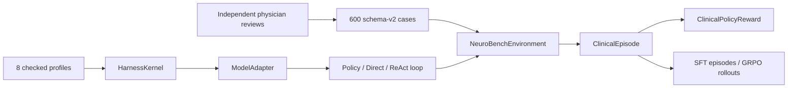

# NeuroBench policy architecture

NeuroBench is a physician-reviewed simulated-patient dataset and executable clinical-policy
benchmark. The current implementation has one strict schema, one typed execution contract and one
reward path. It does not depend on a prescribed reasoning transcript.

## System boundary

The immutable runtime path is:

`HarnessProfile → ModelAdapter → AgentLoop → NeuroBenchEnvironment → ClinicalEpisode → ClinicalPolicyReward`.

Every agent output is either a typed tool call or a typed final assessment. The environment returns
typed observations. Episodes contain only observable actions, observations, costs and token usage;
hidden chain-of-thought is neither stored nor scored.

## Experimental matrix

| Model | Policy | Direct | ReAct |
|---|---:|---:|---:|
| Qwen/Qwen3.5-9B | yes | yes | yes |
| google/gemma-4-E4B-it | yes | yes | yes |
| google/medgemma-1.5-4b-it | yes | yes | no |

Policy is the primary condition. Direct access is a diagnostic upper-bound ablation. ReAct changes
the prompt policy but uses the same typed action protocol, environment and scorer. MedGemma uses
the strict JSON-action adapter because it does not provide native tool calling.

## Data and scoring

Each case defines set-valued acceptable actions, avoided actions, sequencing constraints, stopping
criteria and assessment requirements. This permits multiple clinically defensible workups without
authoring a single preferred trajectory.

The reward reports diagnosis, action coverage, tool accuracy, safety, waste avoidance, sequence,
stopping, assessment quality, monetary cost, token efficiency and invalid actions. Safety caps and
clinical-adequacy gates prevent cheap early stopping from receiving a strong score.

Synthetic policies start as drafts. Reportable evaluation requires two independent physicians to
approve all seven review dimensions, with a third adjudicator for disagreements.

## Interfaces

- Benchmark and training implementation: `agent-platform/src/neuroagent/`
- Profiles: `agent-platform/config/profiles/`
- Dataset contract: `packages/neuroagent-schemas/`
- Cases and split manifests: `data/neurobench/`
- Case authoring and validation: `dataset-generation/`
- Doctor review application: `web-review/`
- API: `/api/v1/runs`, `/api/v1/episodes`, `/api/v1/models`
- Detailed runtime specification: `agent-platform/docs/clinical-policy-harness.md`

Model serving accepts only the fixed three-model panel through vLLM. An API instance stops only the
server process it started; it will not kill or replace an externally managed vLLM process.
